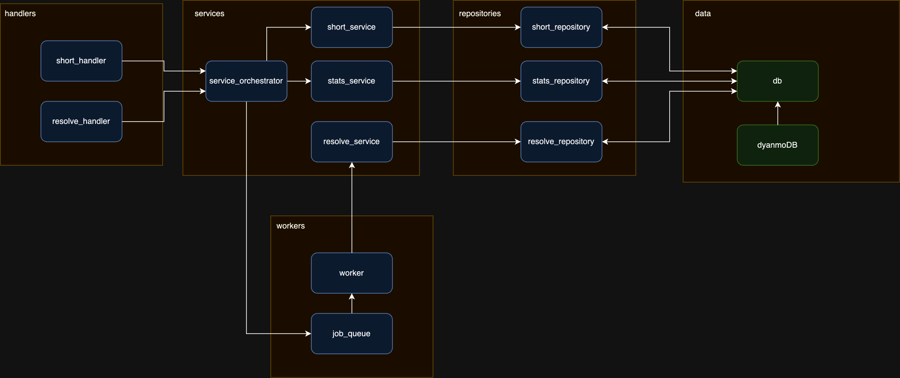
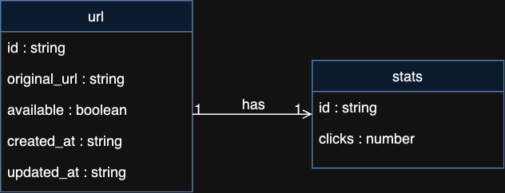
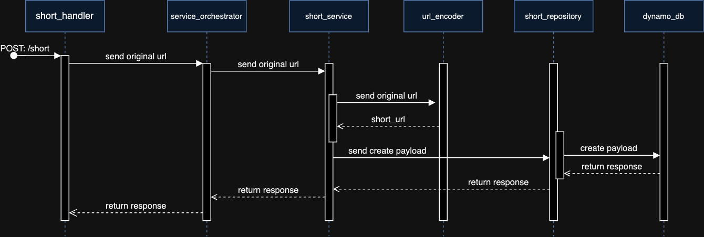
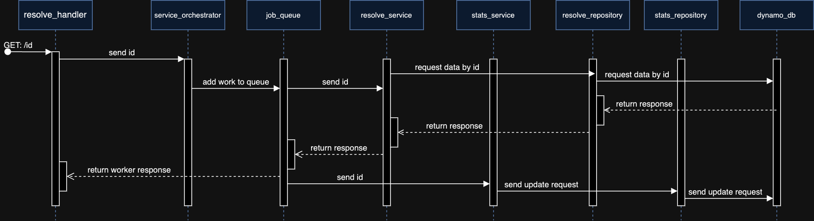
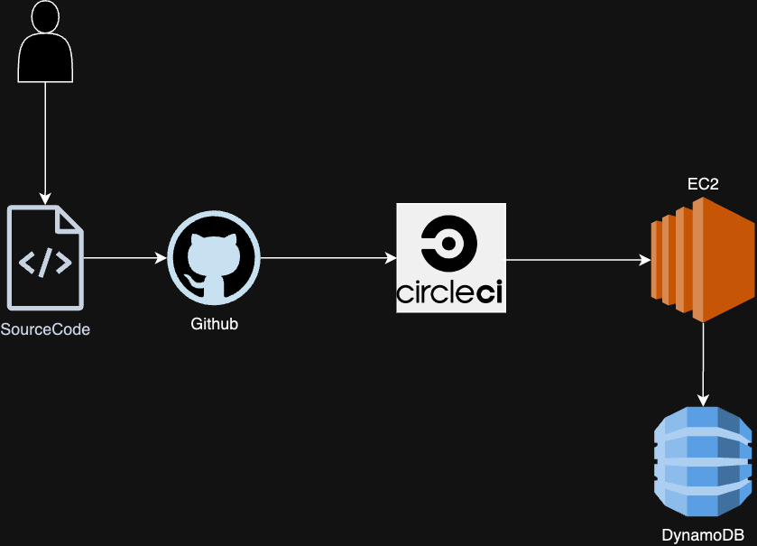
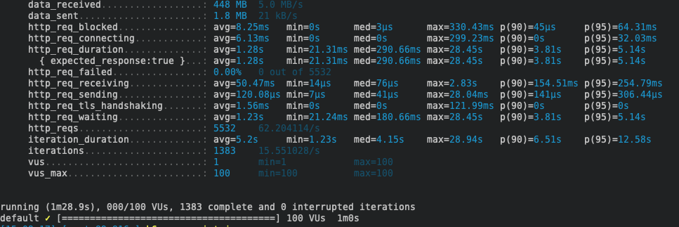

  <h1>ML Url Shortener</h1>
  

    Url shortener project
  

## Pre requisitos

> go 1.18 or higher

## Solución

Para el desarrollo del proyecto se plantearon distintas alternativas de lenguajes, frameworks, bases de datos y uso de servicios cloud, a continuación se detallan las tecnologías escogidas:

- Lenguaje - Golang (v1.23) : Se escogió este lenguaje en particular por su rapidez y sencillez, ademas de su buen performance para cargas de servidor usando las go routines.
- Framework - Fiber : Se escogió por su facil y rápida configuración.
- Base de datos - DynamoDB: Para la finalidad del proyecto se buscaba una rápida y eficiente forma de almacenar y leer datos, una base de datos NoSql como DynamoDB (o mongoDB) es ideal para ese proposito, ademas de el uso de la primary key (partition key) para una rápida búsqueda de datos.
- Instancia EC2 : Se eligio AWS como cloud service para alojar la aplicacion en una instancia de EC2 ademas del uso de DynamoDB.

## Arquitectura del proyecto

Se consideró una estructura hexagonal para el proyecto, esto permite mantener baja la acoplacion del codigo, aislando la logica principal de agentes externos o adaptadores.

**Directorio Core**:

- **Domain** (ej: `shorted_url.go`, `stats.go`): Contiene las entidades de la aplicación.
- **Ports** (ej: `stats_ports.go`, `db_port.go`): Interfaces que definen la implementacion de operaciones.
- **Services** (ej: `link.go`, `stats.go`): Implementaciones de la lógica de negocio.

**Adaptadores**:

- **handlers** (ej: `resolver_handlers.go`, `stats_handlers.go`): Controladores que permiten interactuar con la logica de dominio.
- **repositories** (ej: `stats_repository.go`, `short_repositoryu.go`): Capa de acceso a la data.
- **clients** (ej: `dynamodb_client.go`): Configuraciones para clientes externos como DynamoDB.

## Componentes

En este diagrama de componentes se ve como interactuan cada una de las capas de la arquitectura.

La capa de workers se utiliza para realizar las tareas de resolucion de las url cortas en segundo plano, de forma concurrente y asi evitar la sobrecarga del servidor, ademas de mantener un limite para las operaciones sobre dynamoDB que en la capa gratuita son limitadas.

## Diagrama de clases BD

## Secuencias

Los siguientes diagramas de secuencia muestran las interacciones de los componentes del proyecto para acortar una url y para ser redigirido

### POST: /short - Diagrama

### GET: /:id (resolve) - Diagrama

## CI/CD

El siguiente diagrama muestra la arquitectura diseñada para el proceso de integracion y despliegue continuo.

## Pruebas

Se realizaron pruebas de carga con K6 utilizando 100vus para generar accesos a un link acortado (resolver handler) en un espacio de 1 minuto, obteniendo como resultado 5532 requests exitosos:

## Contacto

Linkedin - https://www.linkedin.com/in/nionate
